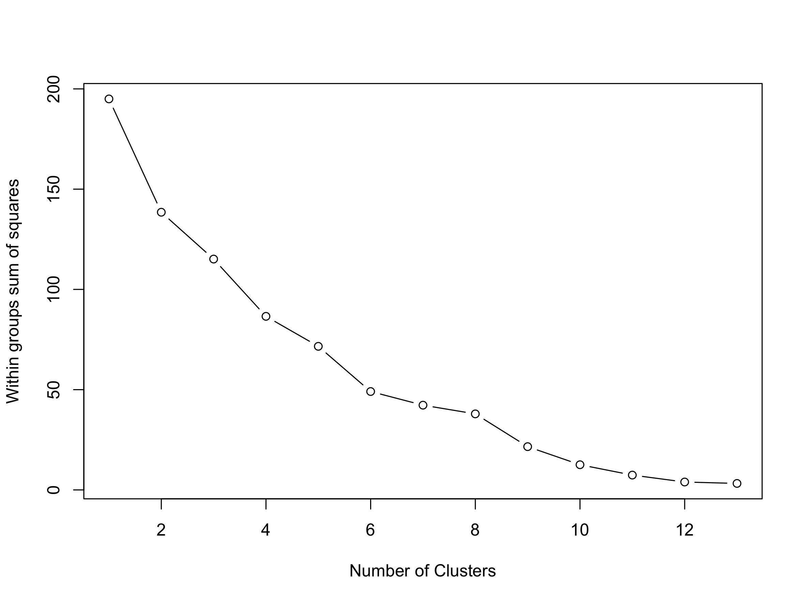
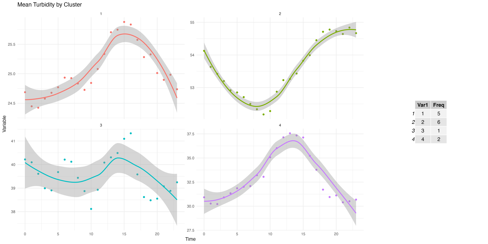

# Diurnal turbidity clustering

R code used to identify diurnal turbidity patterns at USGS stations for the manuscript *Primary drivers of diurnal turbidity patterns in streams across the conterminous United States*.

## How to run the code

The script expects `USGS_15min_turbidity.rds` in the working directory. The input data frame must contain:

- `dateTime`
- `X_63680_00000` (turbidity)
- `site_no`       (USGS station ID)
- `state`         (state abbreviation)
- `dec_lat_va`    (numeric value for decimal latitude)
- `dec_long_va`   (numeric value for decimal longitude)

Install the required R packages:

```r
install.packages(c("tidyverse", "moments", "gridExtra"))
```

Run the analysis:

```sh
Rscript "get clusters from data.R"
```

The script aggregates 15-minute observations to hourly station means, calculates frequency-domain and statistical features, applies k-means clustering, and writes:

- `ElbowPlot.jpeg`

- `mean_turb_by_clusters.jpeg`

- `turb_with_clusters.csv`

The source data are not included in this repository. They are available from the [USGS Water Quality Portal](https://www.usgs.gov/tools/water-quality-portal).

## Citation

Citation and DOI will be added when the manuscript is published.

## Code authors

Galina Shinkareva and Wondwosen Seyoum.
